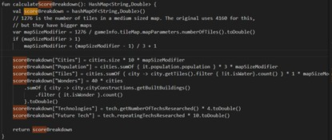

# Civilization Score Calculation

> Author: 华花
> Version: 4.19.12
> Date: 2026-02-14

## Foreword

As the first element of the statistics report, the civ score is often taken seriously by newcomers, while experienced players agree it's actually meaningless.

## 1. Score ratio by map size

Standard medium map: 1276 tiles (Civ V standard map: 80×52=4160). t = 1276 / total tiles of the map used; if t > 1, t = 1 + (t-1)/3.

## 2. Score components

- **Cities score** = number of cities × 10 × t
- **Population score** = total population × 3 × t
- **Tiles score** = non-water tiles owned (water = shallow sea/ocean, lakes don't count) × 1 × t
- **Wonders score** = world wonders owned × 20
- **Techs score** = techs researched × 4
- **Future techs score** = future techs researched × 10

## 3. Summing up

Add all components to get the final civilization score.

## 4. Worked example

Let's verify the formula with a real game:


This is a large map (66×43=2838, t=0.4496); we're the Dutch with 9 cities and 65 population; 2 water tiles, territory 102; 3 wonders built; 20 techs researched. The score is:

```txt
0.4496 × (90 + 195 + 102) + 120 + 80 = 373.99
```

Which matches the shown 374 points.

## 5. Tips

- Smaller maps yield higher scores for equal development; larger maps the opposite.
- Since future techs are rarely researched multiple times in normal games, the civ score can be approximated from report data plus the wonder count in the politics panel — meaning the civ score has no tactical significance.
- In normal games the civ score slowly rises with cities, population, natural expansion and techs; sudden jumps usually come from founding/capturing/marrying cities, completing several wonders, or bulbing many techs at the endgame.
- The civ score reflects long-term strength to some degree; unlike other report data (production, gold, etc.) it rarely swings wildly in the short term. But in-game, pay more attention to short-term data (military rating, key culture milestones) to read the situation and make decisions.

## 6. Code reference

`core\src\com\unciv\logic\civilization\Civlization`

(Note: in the current version the score ratios are defined by the ruleset — read the G&K code for the concrete values)


