# Gods & Kings Beginner's Guide

> Author: 恶
> Editor: SpringPizazz
> Date: 2024-02-19
> Game version: 4.16.0

## Foreword

Since newcomers may find Lance's tutorial hard to follow, I plan to write a basic Unciv introduction myself. I believe that once beginners have a basic understanding of the game, they can understand Lance's early-war strategy tutorial. To further improve newcomers' skills, I made this basic teaching material, hoping every new player can gain a deep understanding of the game.

## 1 Basic yields

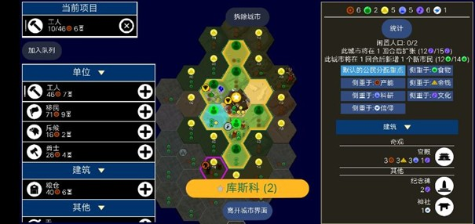

> Note: this chapter is basic content for newcomers. Veterans can skip it.

At the top-right of the game screen you'll see the key numbers, left to right: **Production/hammer**, **Food/bread**, **Gold**, **Science/bottle**, **Culture/music**, **Faith/dove**.

### 1.1 Production

Production is vital in Unciv — it's the basis for building Settlers, Workers, buildings, and military units.

Example: if a Worker costs 46 production and a city provides 6 per turn, it takes just 8 turns to finish.

In practice, production rarely matches the cost exactly, so overflow happens often. Overflow isn't wasted — it carries over to the next build. Food works the same way: surplus food banks toward growth or later builds.

### 1.2 Food

Food is the second most important number — it directly drives population growth. And population isn't just a number; it's tied to many things.

- Each citizen contributes 1 science — population growth indirectly advances tech.
- With trade routes established, each citizen in a secondary city adds ~1 gold to the city's trade route, making food indirectly boost the economy.
- Militarily, more population means stronger city defense and better supply. All units need supply; going beyond supply range incurs a production penalty.

However, food growth isn't unlimited. When a city's **happiness** is low, food yield drops by 75%, hugely slowing growth. Early game happiness is scarce, so population can't keep growing fast.

Also, as population grows, each new citizen needs more food. In early wars, once the capital reaches ~6 population and secondary cities 4-5, players usually shift focus to production — the food cost of more citizens no longer pays off versus pure production.

### 1.3 Gold

Gold matters in many ways:

- Upgrading units — a key way to boost military strength.
- Buying units, buildings, or tiles to accelerate development.
- Important for trades and becoming city-state suzerain.

Early on gold seems unimportant, but ignoring it hurts: without a reserve (at least ~100g) to survive until Market tech, you can hit serious development trouble.

When gold goes negative, things get hard:

- Negative GPT reduces science each turn.
- At -200 gold, the game automatically disbands one of your units — a major blow.

So manage gold carefully and keep a reserve for critical moments.

### 1.4 Science

Science unlocks technologies; pick your tech path based on terrain.

### 1.5 Culture

Culture unlocks social policies and expands city borders. E.g. a city's culture ring takes a horses tile, expanding after 1 turn.

### 1.6 Happiness

Happiness is key to prosperity.

- When happiness accumulates enough, you can trigger a **Golden Age** with various bonuses.
- Sources: improving luxury tiles and building happiness buildings.

Negative effects:

- Happiness ≤ 0 → food yield -75%.
- Happiness < -10 → production -50%.

Keep happiness positive and watch it closely.

### 1.7 Faith

Faith drives religion and special unlocks.

- A Pantheon needs accumulated faith; each new pantheon costs more.
- Early faith mainly comes from the **Shrine** (26 production, 1 maintenance), but the payback is slow (at least 10 turns).

Compared to other early investments:

- **Worker**: no return for 10 turns, but high long-term production.
- **Granary**: fast payback, but limited by tiles and happiness.
- **Settler**: a new city pays back quickly, adds supply and military capability, but may lower happiness.

Despite the Shrine's slow payback, some pantheons help long-term development a lot. **Recommended early-war pantheons**:

- God of the Open Sky (+culture)
- God of Craftsmen (+production)
- Desert Folklore (+faith)
- Monument to the Gods (wonder speed)

### 1.8 Chapter summary

This chapter covered the six basic numbers — production, food, gold, science, culture, faith — their roles and downsides, plus their interrelations, and the key factor tied to them: **population**.

## 2 Terrain, features and resources

> Best read with the map editor open.

### 2.1 Terrain and features

Terrain splits into **rough** (forest, hills, jungle) and **open** (grassland, desert, ocean, etc.).

- Moving into rough terrain costs 2 movement; open costs 1.
- **Marsh** is special: open terrain, but costs 3 movement.
- **Lakes**: inland water; transported armies fight far worse — a natural barrier.

Terrain modification:

- Workers can chop forest/jungle/marsh (tech required).
- Chopping forest gives a one-time yield, priority:
  - Inside borders, rings 1-2: 20 production
  - Inside borders, ring 3: 15
  - Outside borders, ring 2: 13
  - Outside borders, ring 3: 10
  - Outside borders, ring ≥4: 7

#### Vision

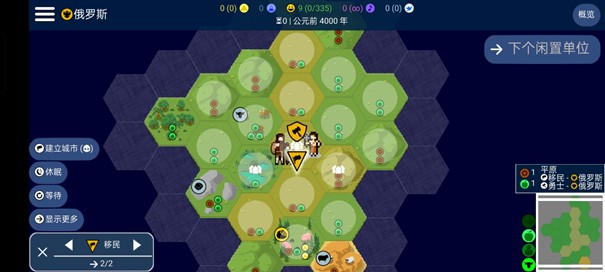

- All units see 2 tiles early.
- Vision is affected by height: **mountains > hills > open**.
  - Low units can't see behind high tiles.
  - Forest gives no height but blocks same-height vision.
- **Fun fact**: standing on a mountain gives flatland vision (design quirk).
- A tile one beyond your vision range is visible if it's higher than you with no same-height blocker in between.

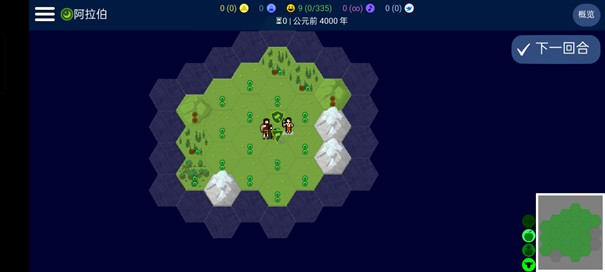

### 2.2 Rivers

Rivers run between tiles, providing:

- +1 gold
- Fresh water

Strategic value:

- Crossing a river costs all movement.
- Melee units attacking across a river get -20% strength.
- Natural defensive barrier.

### 2.3 Resources

Three kinds:

#### Bonus resources

- Provide food and production only.
- **Deer, wheat** matter early — pair with the **Granary** for extra food.

#### Luxury resources

- Each kind gives **4 happiness** (duplicates don't stack).
- Specials:
  - **Salt**: +1 yield after improvement.
  - **Marble**: +15% wonder speed (not stackable).

#### Strategic resources

- Needed for military units/upgrades.
- **Horses** are the early core:
  - enable the Circus (+happiness)
  - required for Chariot Archers.

> Resource count decides development speed — settle near resources when possible.

## 3 Early warfare

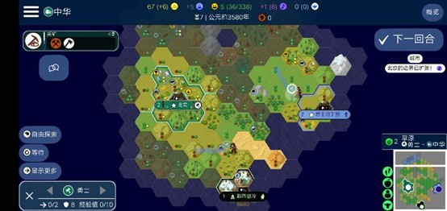

Early military goals: **scout, grab land, harass**.

### 3.1 Scouting

Goals:

- Find good second-city spots (rich resources, defensible, fast to support).
- Locate enemy cities.

> Hill cities have +5 defense and +1 production over plains — prefer hills for secondary cities.

### 3.2 Grabbing land

- Settlers are high-investment, high-return units; the earlier, the better.
- Key spots often get contested.
- Watch enemy zone of control (ZOC) to avoid extra movement costs.

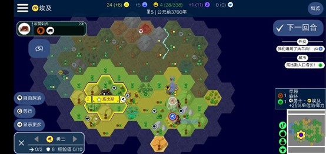

### 3.3 Harassing

- Disrupt enemy development.
- Weaken their strength.
- Create attack opportunities (small raids, damaging resource spots).

### 3.4 Chapter summary

Early military action revolves around scouting, grabbing land, and harassing — plan well to build an edge.

## 4 Early development

### 4.1 Workers

Workers are high-investment, high-return units. Uses:

- **Chopping forest/jungle**: burst production (see table).
- **Improving luxuries** (when happiness is low).
- **Improving strategics** (when happiness is fine — e.g. horses, iron).

| Chop target | Inside borders? | Distance to nearest city center | Burst production |
|----------|------------|----------|----------|
| Forest | Yes | 1 | 30 |
| Forest | Yes | 2 | 30 |
| Forest | Yes | 3 | 22 |
| Forest | Yes | 4 | 15 |
| Forest | No | 1 | 22 |
| Forest | No | 2 | 20 |
| Forest | No | 3 | 15 |
| Forest | No | 4 | 10 |
| Jungle | Any | Any | 0 |

> Jungle chopping gives no production.

### 4.2 Citizen control

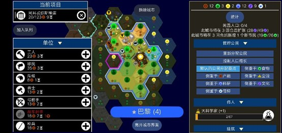

"Controlling production" means manually assigning which tiles citizens work.

- Auto-assignment prefers food, but with **negative happiness** food yield is -75%; auto still picks food, wasting domestic output.
- **Solution**: manually lock high-production tiles; as long as food keeps the population from starving, it's fine.
- How: double-click a tile to lock it.

### 4.3 Buildings

Early building priority (typical order): **Granary → Monument → Library → Shrine**

- **Monument**: +2 culture, faster borders and policies.
- **Granary**: +food, indirectly more production (needs ≥2-food tiles and non-negative happiness).
- **Shrine**: opens pantheon/religion, but a Great Prophet needs 135 faith — long payback.
- **Library**: more science; limited use in early wars, consider when ahead.

> Adjust to the situation — e.g. prioritize the Monument when happiness is low.

### 4.4 Policies

Three main trees:

- **Tradition**: weak in the current meta; not recommended.
- **Liberty**: suits wide players; speeds city development.
- **Honor**: explosive military power, near-unbeatable when strength gaps are large.

Meta build: Honor into Liberty

- When: small maps with barbarians.
- Effect: keeps Honor's 100% military burst plus Liberty's 75% development ability.
- Support: build a Monument or pick "God of the Open Sky" for faster culture.

## 5 Mid-game development

### 5.1 Buildings

In stalemates, add buildings to gain leverage:

- **Stable**:
  - +production on cattle/horses/sheep
  - +15% production toward mounted units
- **Stone Works**:
  - +1 happiness +1 production
  - +production on marble/granite tiles
- **Circus**:
  - needs horses or ivory
  - +2 happiness, cheaper than the Colosseum (17 less production on quick speed)

> Prioritize buildings matching your city's resources.

- **Barracks**:
  - no domestic yield, but new units get +15 XP
  - 1 gold maintenance
  - For: stable domestic + need elite melee (e.g. vs ranged-heavy enemies)
  - Terrain: pick promotions for plains/rough decisive points

### 5.2 Roads

Road advantages:

1. **Fast military support**: quick unit movement, breaking terrain limits (e.g. chariots can move-and-shoot on hills).
2. **Trade income**: connecting capital to other cities yields gold.

> Note: each road tile costs 1 gold maintenance.
> The shortest connection needs 3 tiles (cities can't be founded within 3 tiles), so a secondary city needs at least 3 population to cover road maintenance.

**Conclusion**: don't settle too spread out early.

### 5.3 Wonders

Recommended:

- Great Library
- Temple of Artemis
- Petra
- Hanging Gardens

## 6 Playing the situation

Domestic/tech unlocks need overall consideration:

1. **Resource match**:
   - Many horses/cattle/sheep → prioritize Horseback Riding + Stable
   - Many camps/luxuries → prioritize Trapping + improvement

2. **Terrain fit**:
   - Grassland → Horseback Riding/Stable
   - Forest → Forestry/lumber mills

3. **Situation judgment**:
   - Control > tech > domestic
   - Behind → consider a military comeback
   - Ahead → focus on domestic accumulation

> Avoid researching irrelevant techs on wrong terrain — wasted resources.

## 7 Practice game

### 7.1 The game

**Match**: 恶 vs 陌生的云 祭楼源 (1v1 tiny duel)

- Rich opening: plenty of food tiles, but luxuries need Calendar tech; happiness low.
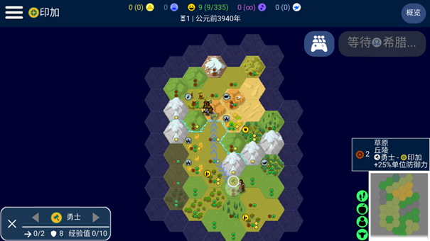
- 恶 opens **Warrior first** for stronger map control.
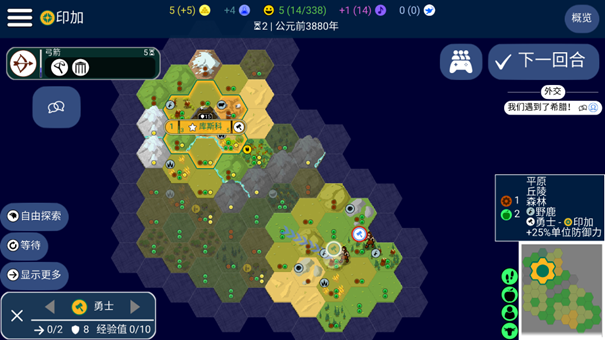
- Meets the enemy Warrior; enemy Scout scouts.
- 恶 judges the south resource-poor and hard to support, abandons it, and instead **goes around to block the enemy Settler**.
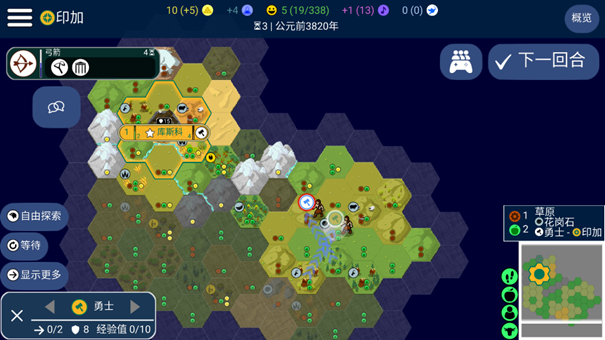
- Finds the north acceptable and easy to support — settles the second city there, using two Warriors to pressure and grab land.
- Successfully blocks the enemy Settler for 2 turns; own Settler arrives safely.
- Mountains block military advance, so switches to **two-Worker chopping for domestic burst**.
- But luxuries are poor and the Granary underperforms; domestic is limited, so switches to a **military rush** — tech to Composite Bowman.
- Despite leading in production (the enemy wasted production on a Granary), the rush **fails due to mountains + river blocking**.
- The enemy exploits terrain to stall and mass-produces units to counter.

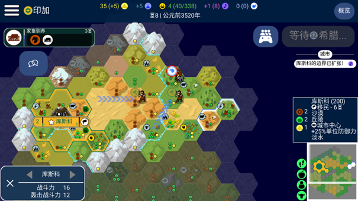
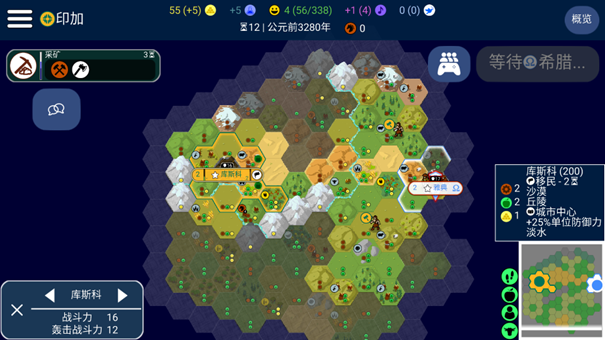
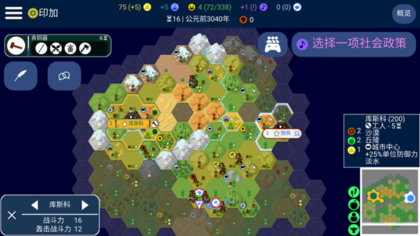
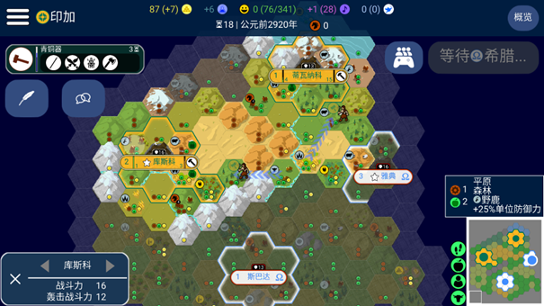
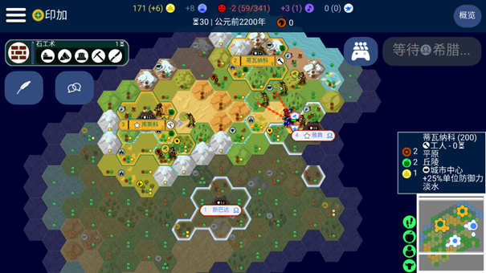

### 7.2 Review

- **恶**: nearly perfect tempo and production lead, but terrain blocked both military and domestic plays — GG.
- **Enemy**: excellent terrain reading; winning from city placement, risked a greedy Granary but terrain bought enough time to win.

## 8 Extras

### 8.1 Honor production card

Honor's left branch: **melee units +15% production**.

Unciv rounds production **half-up**:

- 4 production → 3.4 → shows 3, actually saves 0.6
- 10 → 8.5 → shows 9, saves 1.5
- 17 → 14.45 → shows 15, saves 2

> Usable for extreme production control.

### 8.2 Reloading (save-load)

- Not happy with this turn's moves? Reload and redo.
- Great for scouting: turns probabilistic events (Inca Slinger hits, Germany's barb-camp steals) into certainties.
- **Note**: damage rolls can't be changed by reloading.

### 8.3 Chopping

- Two Workers chopping two forests for the same city in the same turn triggers the production burst **only once**.

### 8.4 Decision-making

Facing special terrain/situations, **never blindly apply formulas**.

- Analyze terrain (mountains: strong defense, slow movement; plains: fast but no cover).
- Adjust to live info (e.g. the victory panel).
- Avoid "aimless play": when lost, pause, define goals, then act.
- If the game is truly unwinnable, **cut losses and restart** — that's wisdom too.

> Flexibility + independent thinking = unbeatable.
