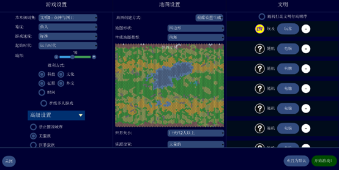
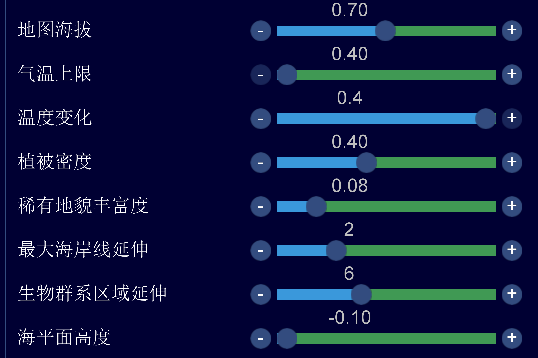

# What to do before Liberty's Left-2? — A 0-40T Liberty Development Guide

> Author: 华花
> Version: 4.19.6
> Date: 2026-02-22

## Foreword

A few days ago I saw a guide full of errors in a QQ group that tried to peacefully farm on a small/medium Pangaea map... which made me feel the lack of proper PvE introductory guides. At 花醉's invitation I wrote this piece, introducing what to do (and not to do) in the opening phase before Liberty's left-2 policy, aimed at newcomers pursuing a science victory in PvE, plus some recent PvE opening explorations and results.

## T-1: Civilization and map settings

In Unciv PvE, when you pick a civilization and open a map, the outcome is often already decided. Civ V players may never have thought that changing just a little can force so many different choices. Map settings are so important in Unciv that they are the foundation of PvE — the prerequisite for all strategies below.

Generally, the opening described here works for almost all civilizations: within the first 40 turns (standard speed) few 3U significantly affect the whole flow. On the same map, except for civs like Spain, Ethiopia, Babylon, France, and India, all civs make similar moves and choices with similar development — at most the pace of milestones and city growth differs. However, given how harsh the environment is, civ strength matters a lot for a good experience. I suggest newcomers avoid blank or near-blank civs (India, America, Germany, Songhai, etc. — ordinary civs without notable production advantages) and pick religious or happiness-oriented civs like Maya or Egypt for a noticeably better experience.

The map used in this guide is special, because standard maps badly hurt the PvE experience.

**Difficulty**: usually Immortal/Deity, default standard speed, Ancient start (Quick in PvP multiplayer); all victory types except Score. Barbarians can be off since they mostly just annoy you. Nukes/spies are irrelevant...

**Map**:

- Quadrangle, huge Inland Sea (hexagon works too, but not flat hexagon; huge to guarantee expansion space; Inland Sea because of many rivers — Thousand Lakes also works; the more like Inland Sea, the higher average quality)
- Ancient ruins and city-states on (equivalent to more resources); wet/legendary arbitrary; abundant resources (preset maps give fewer); wraparound ON (always on when both map edges are land)

**Advanced settings** (based on the screenshot):

- Elevation determines hills/mountains ratio — adjust for terrain-dependent civs like Inca
- Temperature affects large desert patches (for Desert Folklore) — don't change
- Vegetation determines forest/jungle ratio — ~0.8 = all-forest map
- Rare resources ratio for atolls/oases — default 0.05 is fine
- Coastline = shallow sea width — 1-2 is good
- Biomes determine grassland/plains extension — default fine
- Sea level determines water area — lower it to reduce sea luxuries and increase expansion space

**AI and city-state counts**: somewhat arbitrary. Too many crowd the expansion space; too few waste large empty areas. With the settings above, 7-10 AIs and ~1.5x as many city-states (12-16) work well.

The attached save example is an Egypt map rolled by 梦游; feel free to join the PvE QQ group (233275576) for discussion.

## T0-15: The formula opening

Generally follow this formula:

- Settle the capital on a mineable luxury if possible; lock high-yield (ideally 3-food) tiles; build 2 Scouts into Monument
- Tech: Pottery → Mining (even better if ruins pop one of them); Culture straight down the Liberty left line
- Borrow gold from AIs as soon as you meet them; when short of bargaining chips, consider declaring war to recover the loans, grabbing workers while at it
- Buy a Shrine with gold; with spare cash and few high-yield tiles, buy tiles; if still rich, buy a Worker or even a Settler

### Detailed explanation

In an Ancient start, the capital's early build options are quite limited: Worker, Settler, Scout, Warrior, Monument. At 1 population the capital can't build a Settler; the Warrior costs 15 more hammers than the Scout with no movement bonus and its extra strength is useless early — so neither is considered. Modern PvE mostly follows the Civ V formula of two Scouts into Monument. Here's why.

Anyone with PvE experience knows the Scout's value: in no-SL games it provides information for decisions; even in SL (save-load scouting) games, Scouts meet AIs (to trade, eat devaluation, grab workers), meet city-states (for gifts and quests), and complete quests like finding wonders or AI cities. Too few Scouts means meeting AIs/city-states late, with fewer and later returns. One Scout is clearly not enough on a huge Inland Sea, so two in a row is usual; more risks supply penalties and delays the Monument, pushing back the left-2 timing.

The Monument, as the early culture mainstay, also greatly accelerates the left-2 milestone — build it right after the Scouts.

Note: opening with a Worker is a classic PvE mistake — a Worker costs 70 hammers (about 1 Scout + Monument). Building it delays scouting and left-2 timing; by ~T15 your starting Warrior can already reach an AI's capital and steal a worker home anyway. A self-built worker can only farm/mine, providing little while eating precious scouting/left-2 time, and misses the luxury-slot niche — and with a mine-luxury settle you don't even need a worker that early...

Most of the above matches Civ V openings; below are some opening tricks unique to Unciv.

### Trick-war (骗宣)

In Civ V, cash trades are only possible after friendship declarations or during peace talks. To break a lux/GPT-for-cash deal you must declare war on your ally (or usually-renewable ally) or wait 10 turns after a peace treaty and declare again. Either way takes a lot of time and is inefficient. With scarce river gold, players lack bargaining chips and AIs often have little cash.

In Unciv none of this is needed: with river GPT or mine GPT plus luxuries you can quickly drain 1-2 AIs' cash. But with 7 AIs you'll soon run out of chips while AIs still have cash — that's when you declare war on your AI creditors to recover the GPT. This way most AIs' cash ends up in your pocket: using your chips as leverage, you can pry money out of 5-6 AIs.

> **Note**: trick-war (and fort-scam cash) is widely considered unethical in Civ V — many top players say they never use it. However, as Unciv keeps making the environment harsher and the AI weirder, trick-war is widely accepted among PvE players — after all, nobody blames a drowning man for grabbing anything afloat.

### Settling on a mineable luxury

Even though trick-war reduces peak chip pressure, an early capital on a river mine gives only ~10 GPT — enough for 220g. Even against poorer Immortal AIs, chips run dry by the second AI you meet. With only the capital (or one more city), GPT barely grows — chips remain insufficient. Unciv's common chips are GPT, luxuries, and embassies/open borders; with no diplomatic chips at opening, you must develop luxuries.

That raises a problem: for non-mine luxuries (Calendar/Hunting), you wait until ~T30 to improve them — 10 turns of lost cash compared to mine luxuries. Even mine luxuries need a stolen worker and 7 turns to hook up; meanwhile AIs spend their cash on buildings/land, money down the drain. So what's the fastest way to get a luxury? Settle the capital **on** a mineable luxury — the moment Mining arrives you have it, trade it as chips for cash, and start snowballing. As the ancients said: mine-luxury settle = an El Dorado next door!

### Buying the Shrine

PvE farming requires a religion. Apart from Ethiopia and the Celts, the only reliable early dove source is the Shrine (super-rare high-roll 3 religious city-states nearby can give +4 dove from meeting them, but that's too rare). If you self-build the Shrine after the 2-Scout-Monument opening (~T16), it finishes around T20+, and you'd found a pantheon at T30+ with 10 doves. But a T30+ pantheon is extremely dangerous: religion-blank AIs also found pantheons around T30+; if the AI steals Desert Folklore, the game is basically lost; even if they take something else, being second costs 15 more doves (5 turns), during which another AI may cut in — high risk. Meanwhile a Desert Folklore map gives 5 dove/turn once the pantheon is up — you want it early to accelerate founding your religion.

Since self-building is risky and low-value, use the early gold to buy instead: a Shrine is 40 hammers / 200g, easily affordable with your own gold plus traded cash. Its 5.00 hammer/gold ratio compares well with the Worker's 70/310 = 4.43. As long as Ethiopia and the Celts aren't in the game, buying the Shrine almost guarantees first pantheon. In theory you can buy it as soon as Pottery unlocks (~T10) and found the pantheon at T20 — 10+ extra turns of pantheon doves compared to self-building. Excellent results.

## T15-40: Capital development and global resources

Ignoring ruins and city-states, a Monument opening reaches Liberty's left-2 around T45; in practice, with cultural city-states and culture ruins, players usually get there by T40, then cycle Settler — project — Settler until enough cities. So during T15-40 the main tasks are developing the capital and securing global resources, laying the foundation for left-2 settlers and later development: grow the capital to 5-6 population and improve working tiles (hills especially) to raise base production for future overflow, while using spare production to build units / buildings / wonders to supplement capital development or grab global resources only available in this period. Details below.

### Military strategy

Building military doesn't help the capital; the point is using force to obtain global resources. In Unciv's environment peace treaties are nearly useless, and with AI expansion and military exploding, army value depreciates fast — so mass military for maximum profit inevitably leads to conquest. When an AI is close, terrain is flat, rivers abound, resources are rich, and you have strong early UUs (Babylonian Bowman, War Chariot, etc.), consider a conquest opening: keep producing units to suppress, then siege cities once chariots/archers arrive. Recently a more effective conquest method was found — described below.

Recently discovered: stealing an AI's 1st/2nd Settler before it settles makes the AI repeatedly rebuild settlers instead of military — the AI becomes your worker machine. With just the opening units you can slowly collect ~10 workers, like opening three El Dorados. Meanwhile, with few cities, the capital keeps producing settlers and its military keeps being consumed — the AI can never come online. Around T70 you can harvest its capital with similar forces to a conquest opening. Given heavy production devaluation and the huge worker count from this flow, even failing to take the capital is hugely profitable. This method needs 1 Warrior + 1 Scout/Spearman camping the line between a nearby AI's capital and its second-city spot at ~T15 to intercept settlers on flat ground — fairly stable in SL (save-load) games, almost impossible in no-SL. The attached example save uses this method.

### Building strategy

The building strategy focuses on capital development, providing almost no global resources. After Monument + Shrine, the only Ancient-era building giving global yields is the Library — too little return, awkward tech; usually skipped. Basic yield buildings like the Granary are more popular: capitals often have wheat/deer/banana bonus resources nearby, and with a Granary you can jump from 3 to 5-6 population in time for left-2. The Water Mill needs later tech; Masonry is similarly gated by tech and improvement progress. So the building strategy often hits the dilemma of surplus production but slow tech with nothing to build — in which case you build a few defensive units or self-build workers for improvements.

### Wonder strategy

Like military, wonders mainly provide global resources. Early wonders include the Great Lighthouse, Stonehenge, Great Library, Temple of Artemis, Pyramids, Statue of Zeus, and Mausoleum — of which only Artemis, Pyramids, and the Great Library are worth contesting this early. The Pyramids, given low AI building priority, can be overflowed cheaply after left-2 — and this early there aren't many tiles to improve anyway (too many units even incur a supply penalty), so it's usually not rushed. The Great Library this early only beelines Philosophy; the free tech can speed Aqueducts/Civil Service, but it feels weaker than basic yields... Temple of Artemis is the safe pick: even Deity AIs love it, but +10% food is still a big deal worth contesting. Note: in SL you can peek the save so wonder races carry no risk; in no-SL, good luck — Unciv has too little information, so wonders are largely a gamble.

### Gold management

Since you keep borrowing from AIs and stealing workers, a single city soon faces "can't spend money" (buying buildings is wasteful, buying city-states without quests is pointless) plus supply penalties. So save up ~500g to buy a Settler — dodging the supply penalty while the extra doves speed up founding your religion (the left-2 free settler is similar: the new city needs a fast religion to produce white cities and save missionary doves).

### City-state management

City-states start issuing quests at T30 (4.19.6 still allows SL; after 4.19.12 you can't SL quest rerolls, but you can edit the save's player civId to change quests). Before that, throwing gold without a quest is a loss. If willing to SL, prefer quests completable within 10 turns (nearby lux / AI's main lux, finding natural wonders, nearly-finished wonders, finding AI cities, etc.); for mystery sea-resource/remote-wonder/great-person quests, just SL back. Meeting + 250g after 10 turns gets you an alliance — doubling returns. For militaristic city-states with no useful quests, don't bother: declare war later for +10 influence with all allied city-states instead (so every city-state has value — militaristic ones just offer influence rather than units, plus maybe extorted gold?).

### Religion development

On a standard Desert Folklore map, religion is founded around T40. Usually rush-enhance with Burial Customs + Pagodas/Shrine-Temple faces + Holy Scriptures; order doesn't matter much since AIs don't care much about these beliefs (except Holy Scriptures & Temple face)... Just don't pick the Temple face as Maya and gimp yourself.

## Appendix

Attached is a T0-50 save (SL) from the author — try whether you can follow this guide and achieve better development!

Egypt opening save.zip

Link: [https://pan.baidu.com/s/1zL2GeWAPIkvDxv51E5FTmw?pwd=9iha]
Code: 9iha

Feel free to join the PvE QQ group (233275576) for discussion.
