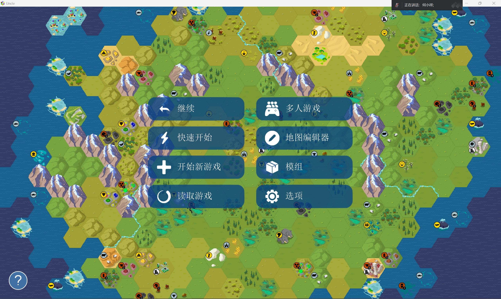
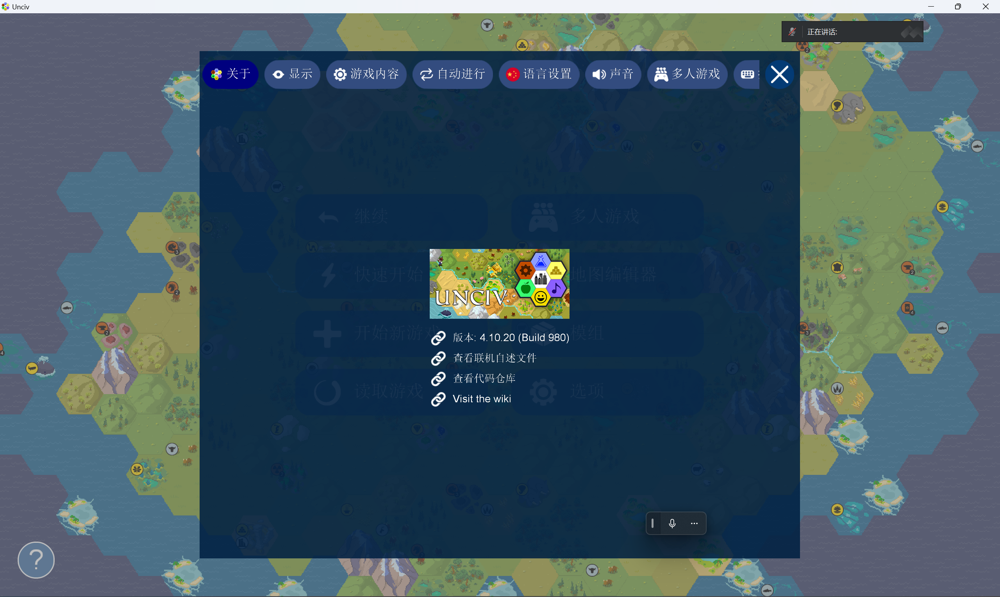
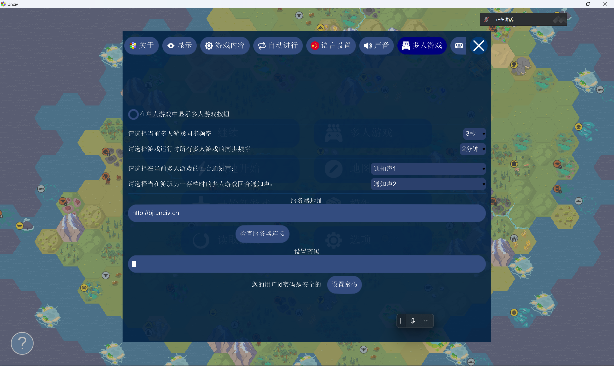
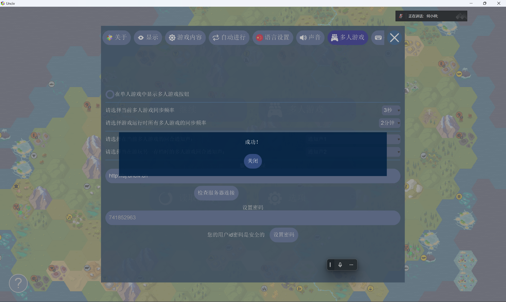
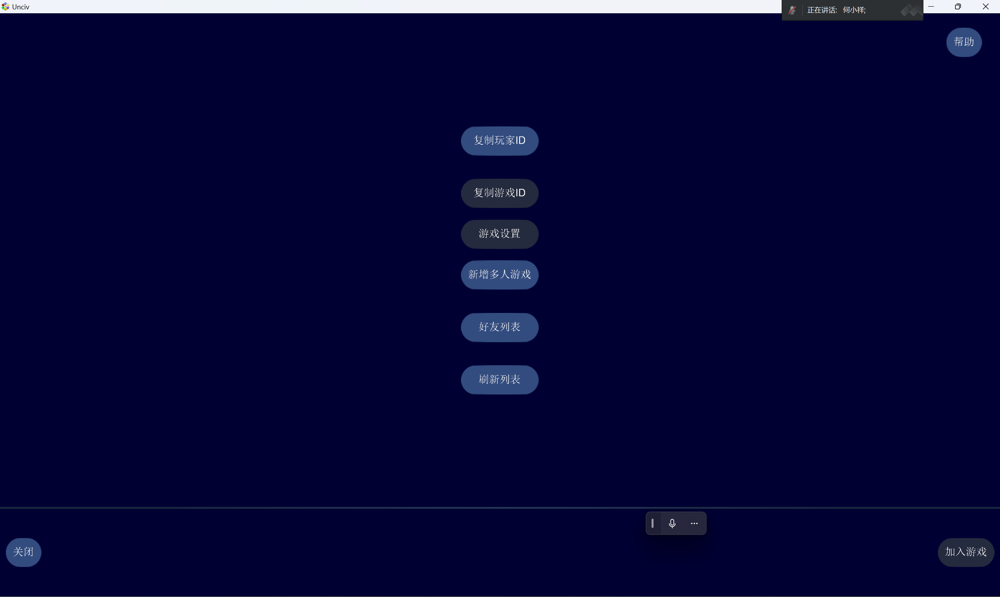
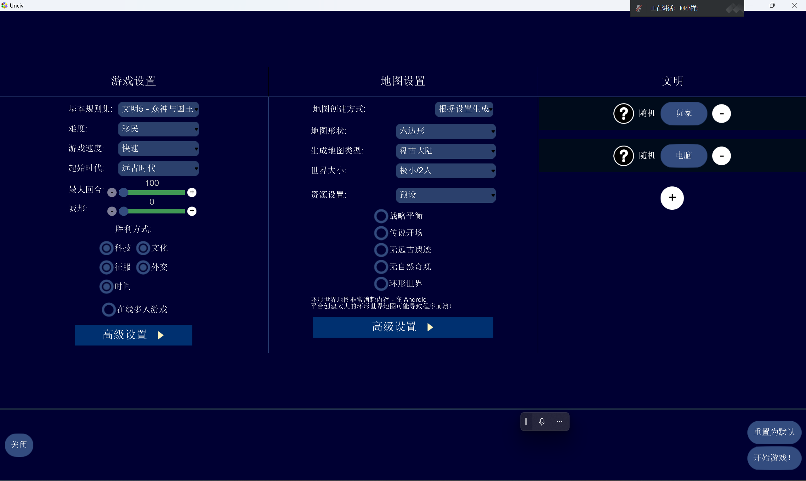
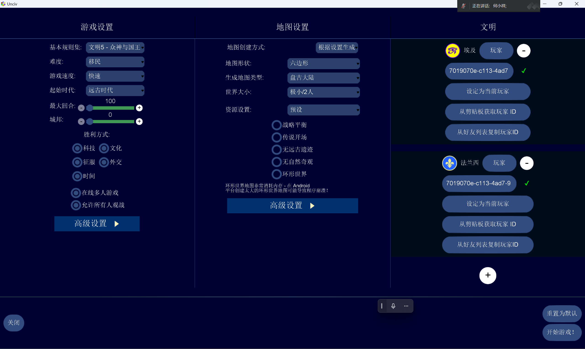
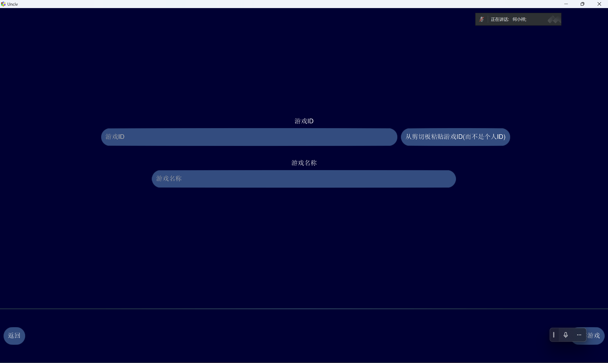

# Unciv Multiplayer Tutorial

> Author: SpringPizazz
>
> Date: 2024-03-27

Before playing multiplayer, understand the UID: UID stands for User Identification. In Unciv multiplayer there are two kinds: the **player ID** (identifies players) and the **game/room ID** (identifies a match).

Players must also allow Unciv to access the clipboard (especially on Android) so the game can read/paste these UIDs.

All participants must strictly use the same game version, the same mods, and the same mod versions to avoid unknown errors.

## Connecting to the multiplayer server

Open the main menu, click "Options",

Click "Multiplayer" on top,

Enter the server address: <http://sp.unciv.cn:30123>

Set the sync frequency as shown above,

Set a password (default is 123456) to prevent others from impersonating your player ID and disturbing your games,

Click "Check server connection" — a "Success!" popup should appear,

Exit Unciv (kill background processes), reopen it, return to the same screen and click "Check server connection" again. If it still says "Success!", you've successfully connected to the server!

## Getting your player ID

Back at the main menu, click "Multiplayer",

Click "Copy player ID",

Your player ID is now on the clipboard!

If you're hosting, keep your player ID; if you're joining, send this player ID to the host via social media (e.g. QQ), stating clearly that it's a player ID (not a game ID).

## Host creating a room

Back at the main menu, click "Start new game",

Click "Online multiplayer",

Paste the player ID into the corresponding text field and pick your civilization,

Choose the map settings, then click "Start game!" at the bottom right. When you reach the game screen, the room ID is automatically saved to your clipboard — send it to all participants, stating clearly that it's a room ID, not a player ID.

## Participants joining a room

Copy the host's room ID to your clipboard,

Back at the main menu, click "Multiplayer",

Click "Add multiplayer game",

Paste the room ID in the first text field; enter your note for this game in the second field (leave empty and it's overwritten by the room ID).

After entering, click "Save game" at the bottom right, return to the previous page, click the button showing your note, and click "Start game" at the bottom right to join the match.
