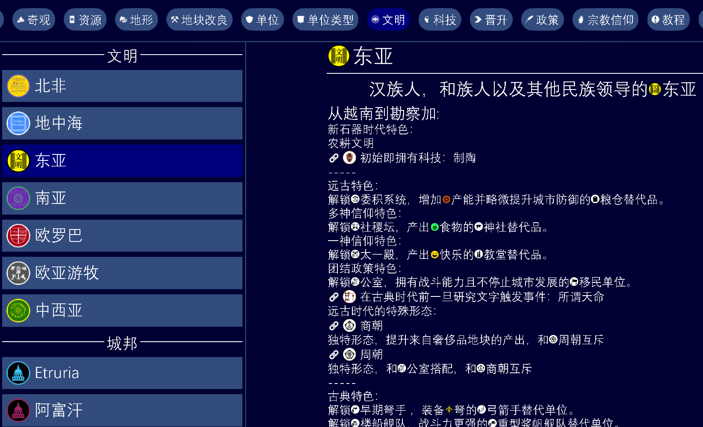
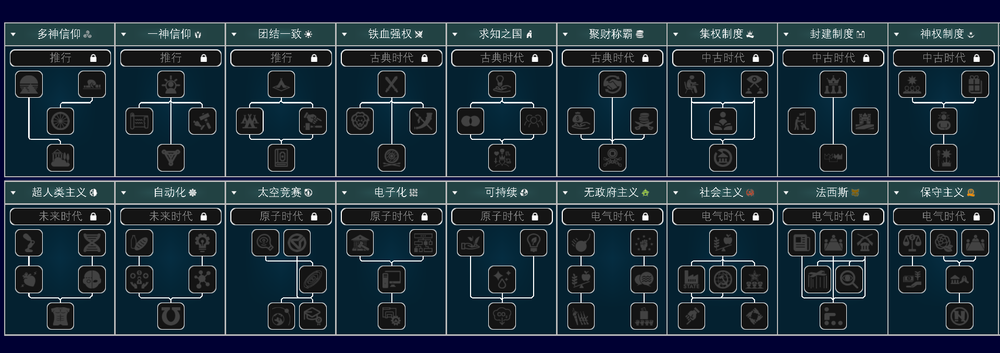
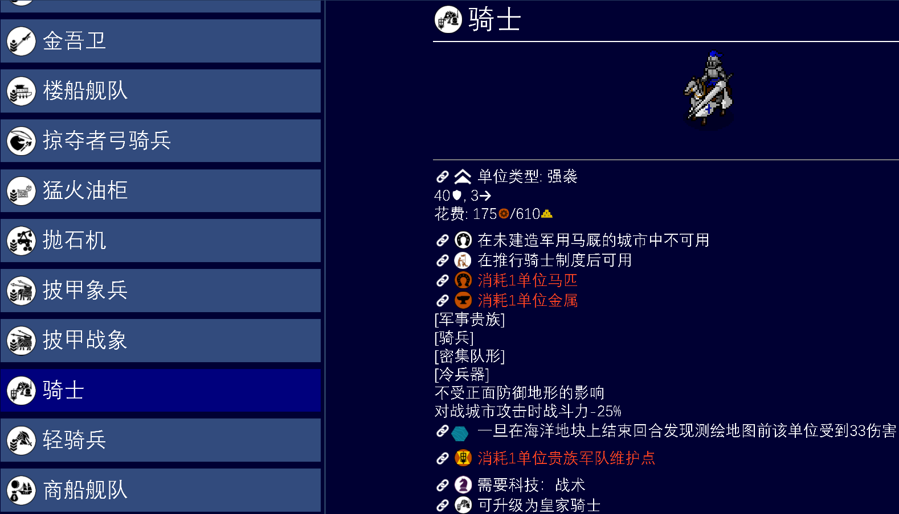
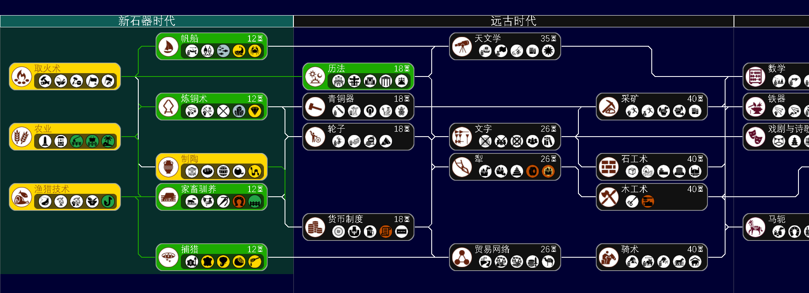
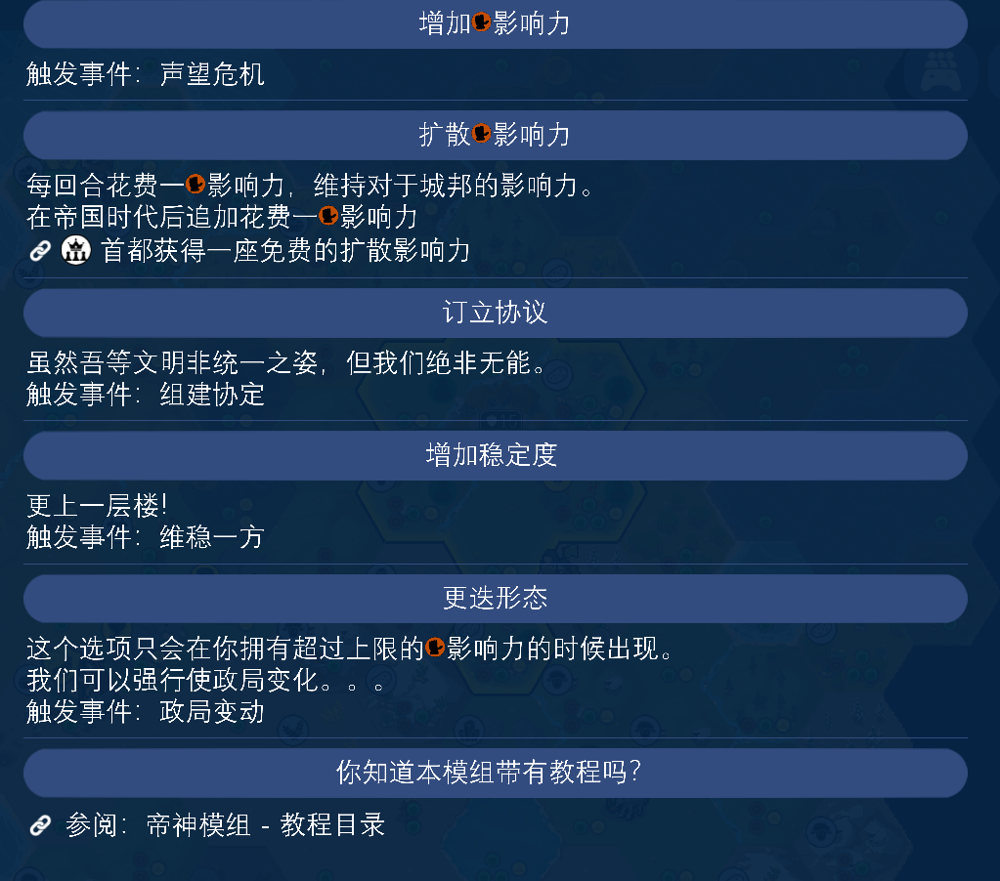
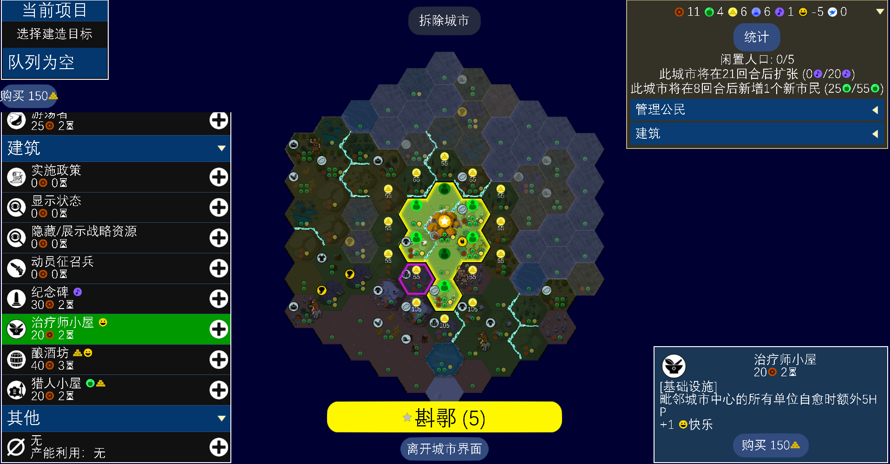

# Emperors and Deities (EnD) Introduction

## About EnD

Emperors and Deities (帝王和神明) has neither emperors nor deities — it's a large-scale ruleset reset mod that overturns how Unciv/Civ V plays. It includes:

* **Diverse in-game path choices**: policies, religion, historical governments, events. It borrows from Civ VII and Humankind mechanics, but restructured with personal understanding. Choose a region at the start, and all the peoples and civilizations of this colorful land answer to you. (Post-Medieval content under construction.)

  

  
* **Fully refined unit and building mechanics**: units and buildings are not just massively increased in number, but also have detailed categories and Tag support, closely tied to in-game paths. Do you hand military power to hereditary military aristocrats, or push professional-army reform?

  
* **Fully refined tech tree**: from Neolithic starting techs to line infantry of the Imperial era, from Industrial-era telegraphs to Information-era data centers. EnD's tech tree covers many areas the original doesn't, including papermaking, cement, fixed ammunition, and more. ~~And basically every tech is juicy.~~ (Electricity-Future eras currently under construction.)

  
* **Happiness mechanic reset**: the backbone of your Golden Age is no longer mere luxury resources, but the windfall profits they bring. Luxuries no longer provide happiness directly; a new municipal building tree, medical building tree, and other infrastructure determine the difficulty of city governance. Fully assimilating cities also requires significant preparation.
* **All-new stability mechanic**: unhappiness triggers negative events that hurt your stability, then rebels and debuffs bloom in both directions. Only by spending your accumulated influence can you turn the tide. Of course, building sound municipal governance is the real cure.

  
* **More little touches**: move surplus population/resources from one city to another? Sure! Make Shang defeat Zhou, or Harappa defeat the Aryans? Up to you. Even blank civs can enjoy most of the content through in-game growth.

  

### Core philosophy

> "能改的全部动了。" - CX61 ("Everything that could be changed, was changed.")

The mod is faithful to historical accuracy — not as endless unbounded detail, but selecting what fits Civ's hex-grid gameplay and refining it, so players experience a fresh side of the Civilization series.

### Quick links

::: tip Mod resources

- [GitHub repository](https://github.com/chenxing61/Emperors-and-Deities)

:::

### Join the community (urgent)

For suggestions or issues, join our QQ group:

Or the Discord server:

### Anyway, please try the mod! Nobody plays = no balance tuning and no QoL!!!

### Installation

1. Download the latest mod files
2. Put the mod folder into the game's `mods/` directory
3. Enable Emperors and Deities in game settings
4. Start a new game to play
5. Or, if you have GitHub access, download it directly in-game.

::: warning Note

- The mod only supports new games; it is incompatible with existing saves
- Standard speed is recommended for the best experience

:::

### Thanks

Thanks to all players and developers who contributed to the mod!

Special thanks to:

- The Unciv development team for the excellent game platform (Yarim and other hard-working devs)
- All players who tested and gave feedback
- The Unciv community's support (the modding masters)
- Community members who provided translations
- Bucketeer for art support
- And you, reading this!
